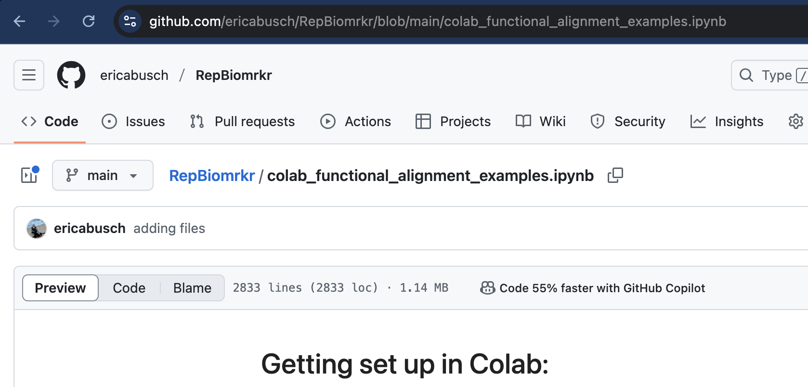
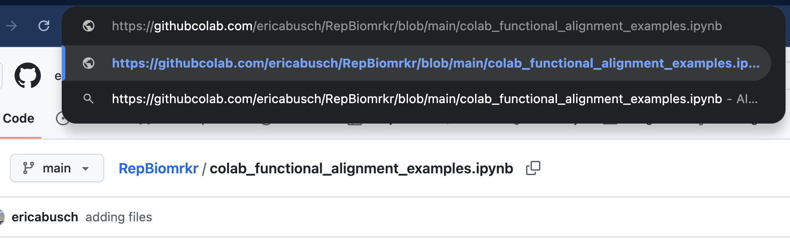
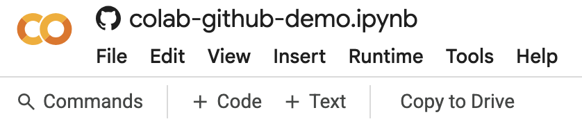

# RepBiomrkr repository
Representing fMRI data to isolate mental health biomarkers
Resources corresponding with our recent Perspective paper: [link tbd]
ELB May 2025 

## To run this code locally:
Clone this repository (or download it) and use the notebooks `functional_alignment_example.ipynb` and `manifold_learning_example.ipynb`. They will import code from the python scripts and data from the `sample_data` directory. You can also create your own notebook and source these scripts yourself.

You will likely want to create a conda environment for this. If you already have conda installed, you can create an environment (sample name my_env) with the requirements file: 
`conda create --name my_env python=3.11 numpy=2.0.0 seaborn=0.12.2`; `conda activate my_env`; `pip install requirements.txt`

## To run these tutorials on colab: 
Fork the repository into your own github account, and navigate to your fork. Then, choose which notebook you want to work with first and open it in github: 

Then, in the browser line, substitute 'github' with 'githubcolab'. This will open the notebook in Google Colab:

From here, you can create a copy of it in your Google Drive account by clicking `Copy to Drive` at the top, or not (if you save it, it will prompt to save the changes to your Github repository).

Then you will follow the instructions within the notebook to clone the repo into your colab session and access the data.

Alternatively, you can download the notebook from Github, open https://colab.research.google.com, upload the notebook that you downloaded, and continue from the instructions within the notebook. 

